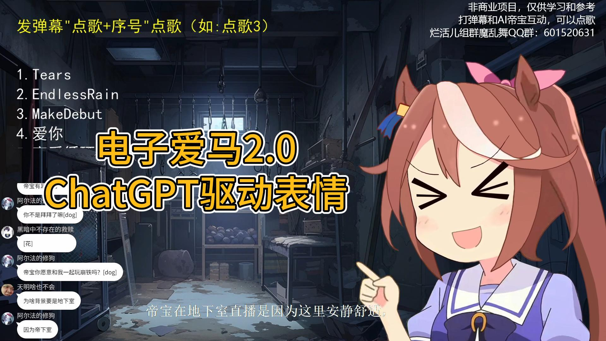

# AI virtual live broadcast anchor

Demonstration of an AI virtual live broadcast anchor program that can be broadcast live on station B. The project uses [ChatGPT](https://openai.com/blog/chatgpt) as the AI engine driver logic, [VITS](https://github.com/jaywalnut310/vits) for speech synthesis, and Live2D for character expression. 

## Project display
<!--- https://github.com/mattcone/markdown-guide/blob/master/_basic-syntax/line-breaks.md: two or more spaces--->
- [1.0 Demo](https://www.bilibili.com/video/BV13L41197oZ)  

- 2.0 Demo
  - [Song request system](https://www.bilibili.com/video/BV1Rp4y157of)  

  - [Expression system](https://www.bilibili.com/video/BV1ok4y1A7fb/)  


## Project functions and features

- Use ChatGPT as the AI engine, specifically using the [ChatGPT(revChatGPT)](https://github.com/acheong08/ChatGPT) third-party library
- Use VITS for speech synthesis, specifically using the Chinese and Japanese language weights trained on Honkai Impact 3 and Ma Niang data sets. Here is the speech synthesis model [Demo](https://huggingface.co/spaces/zomehwh/vits-uma-genshin-honkai)
- Use Live2D for character expression
- Use [VTube Studio API](https://github.com/DenchiSoft/VTubeStudio) to drive character expression animation, and use ChatGPT to obtain the character's speech emotions. Specifically use the third-party library [pyvts](https://github.com/Genteki/pyvts)
- The entire project uses multi-process parallel optimization. Barrage pulling, requesting ChatGPT service, sound synthesis, voice playback and animation control are all processed in parallel to ensure the response speed of real-time interaction between characters and the audience.
- Song request function, the character will thank the audience for their likes and gifts while singing. The song tracks use AI voice changing technology ([Sovits](https://github.com/svc-develop-team/so-vits-svc), [DiffSVC](https://github.com/prophesier/diff-svc ), etc.).
- Simple subtitle interface

## Instructions

```python
python app.py
```

## Contributors

### Main Developer

Bad job group:

- Meow Meow Tongfeng [GitHub homepage](https://github.com/whiteeat) [Bilibili homepage](https://space.bilibili.com/7627329)
- LeoJknan [GitHub homepage](https://github.com/leojnjn) [Bilibili homepage](https://space.bilibili.com/603987001)
- CYMIC [GitHub homepage](https://github.com/hellocym) [Bilibili homepage](https://space.bilibili.com/88937421)

### List of contributors to AI synthesized song works

- CYMIC: Endless Rain, Tears
- LeoJk Nan: love you, love cycle, etc.
- Τυχαίο: Spring wind, today you will marry me and so on [Bilibili homepage](https://space.bilibili.com/381910197)
- Mouzifufu: Running towards the wheelchair (not AI) [Bilibili homepage](https://space.bilibili.com/294006665)

### Special thanks to

- CjangCjengh [GitHub homepage](https://github.com/CjangCjengh) [Bilibili homepage](https://space.bilibili.com/35285881)
Thanks to him for designing cross-language phonetic notation and training methods. [Project address](https://github.com/CjangCjengh/vits)
- Saya is sleeping [GitHub homepage](https://github.com/SayaSS) [Bilibili homepage](https://space.bilibili.com/5955895)
Thanks to his training of high-quality horse racing girls in Japanese weights. [Station B display video](https://www.bilibili.com/video/BV1UG4y1W7Ji/) [Online Demo](https://huggingface.co/spaces/zomehwh/vits-uma-genshin-honkai)

### Other thanks

- choom [GitHub homepage](https://github.com/aierchoom) [Bilibili homepage](https://space.bilibili.com/95978418)
Technical Support
- Angel Sinana [Bilibili Home Page](https://space.bilibili.com/3494352250734879)
The most loyal fans in the early stages of the project, actively participating in testing
- And other friends who support the project

### join us

Bad Job Group Demon Luanwu QQ Group: 601520631
